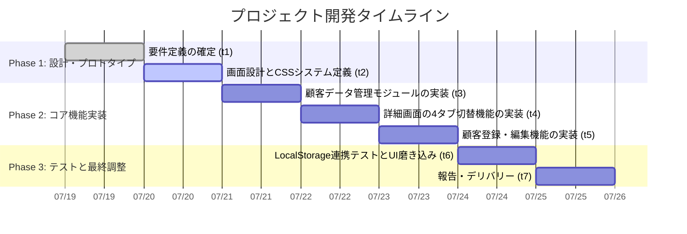

# 02_作業計画書 (WBS): セラピスト向け顧客管理アプリ

## 1. プロジェクト・タイムライン (AI加速設計)
本プロジェクトは、短期間で直感的な高品質スマホ向けUI/UXを実装するため、Vanilla JSおよびLocalStorageを用いたシンプルなモジュール構成を採用し、開発工数を削減します。

## 2. タスク詳細 (3階層構造)

### ■ Phase 1: 設計・プロトタイプ
- **Task 1.1: 画面設計とデザインシステムの定義**
    - Step 1.1.1: `index.css` を作成し、カラーパレット（HSL）、グラデーション、ダーク/ライトテーマ、スマホ最適化グリッドの変数を定義する
    - Step 1.1.2: 基本的な画面骨組み（ヘッダー、検索バー、顧客一覧リスト、詳細表示パネル）のワイヤーフレームを定義する

### ■ Phase 2: コア機能実装
- **Task 2.1: 顧客データ管理モジュール (Core Logic) の実装**
    - Step 2.1.1: LocalStorage に対するCRUD操作、初期サンプルの自動ロードロジックをJSモジュールとして分離実装する
- **Task 2.2: 顧客詳細画面のタブ切替機能の実装**
    - Step 2.2.1: 「来店回数」「施術内容」「金額」「個人情報」の4つのタブを切り替えるDOM操作・表示更新ロジックを実装する
- **Task 2.3: 顧客追加・編集・検索機能の実装**
    - Step 2.3.1: 顧客検索とインクリメンタルフィルタリング機能を実装する
    - Step 2.3.2: 顧客追加フォームおよび編集モーダルダイアログを実装する

### ■ Phase 3: テストと最終調整
- **Task 3.1: 実機検証とレスポンシブ調整**
    - Step 3.1.1: Chromeデベロッパーツール等によるスマホ画面でのタップ領域、スクロール感の調整を行う
    - Step 3.1.2: テーマ切替や文字入力時の `scrollHeight` 自動リサイズなど微細なUI同期とアニメーションを実装する

## 3. 状態管理
| ID | タスク名 | 内容 | 状態 |
|:---|:---|:---|:---|
| t1 | 要件定義の確定 | 要求・要件定義書の合意 | 完了 |
| t2 | 画面設計とCSSシステム定義 | UIスケッチ、基本CSS設計 | 進行中 |
| t3 | データ管理モジュール | LocalStorageとCRUDロジック | 未着手 |
| t4 | 4タブ切替機能 | 詳細画面の切り替えUI | 未着手 |
| t5 | 顧客登録・編集・検索 | 検索・フォーム処理 | 未着手 |
| t6 | 検証とUI微調整 | 実機確認、アニメーション調整 | 未着手 |
| t7 | 報告・デリバリー | 実装報告書作成、成果物引渡 | 未着手 |

## 4. 技術的挑戦・リスク
- **スマホ特有のスクロール挙動**: リストが長くなった際のモーメンタムスクロールや、タップレスポンスの遅延（300ms遅延対策）。
- **データ永続化**: `LocalStorage` の容量上限や破損時の対策（必要に応じてリセットやエクスポート機能を検討）。
